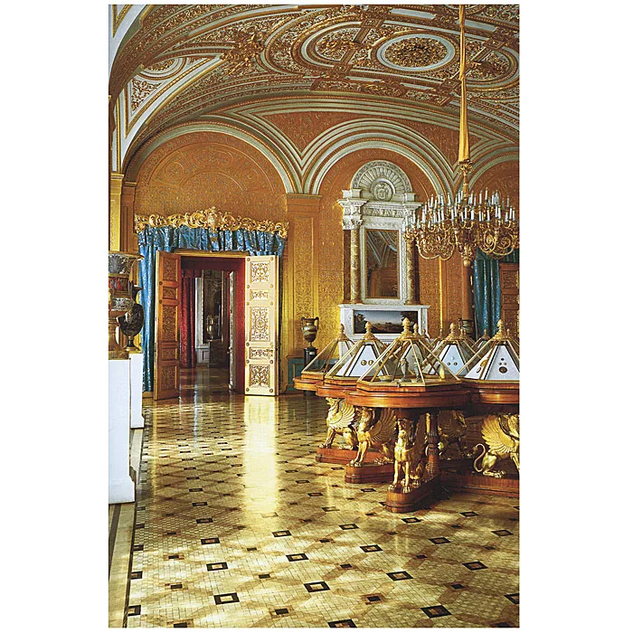

# Задача "Сформировать структуру базы данных для музея"

- [x] Посетить любой музей в вашем городе. Сделать фотоотчет (фото музея, себя на фоне музея/внутри музея)  
- [x] Составить в экселе базу данных со следующей структурой: название таблиц, название полей, название параметров, описание полей, описание параметров.
- [x] База данных должна включать не менее 30 таблиц!  
- [x]  Нарисовать взаимосвязи таблиц (miro/draw.io/excel).  
- [x]  Написать сценарий использования созданной базы данных.

## Описание решения задачи
В рамках выполнения домашнего задания и для модуля "База данных в музее" был посещен самый известный музей Санкт-Петербурга "Эрмитаж"

### Фотоотчет
 
 
 
 

 

В ходе написания структуры таблицы, я попыталась максимально ракрыть ее значение, но не смогла сделать 30 таблиц и связать их(получилось меньше).

## Сценарий использвания базы данных

Данная база данных хранит в себе множество связей живописи, скульптур, археологических находок, предметов прикладного искусства, их создателей и выставок

- Схема взаимосвязей прикреплена файлом 